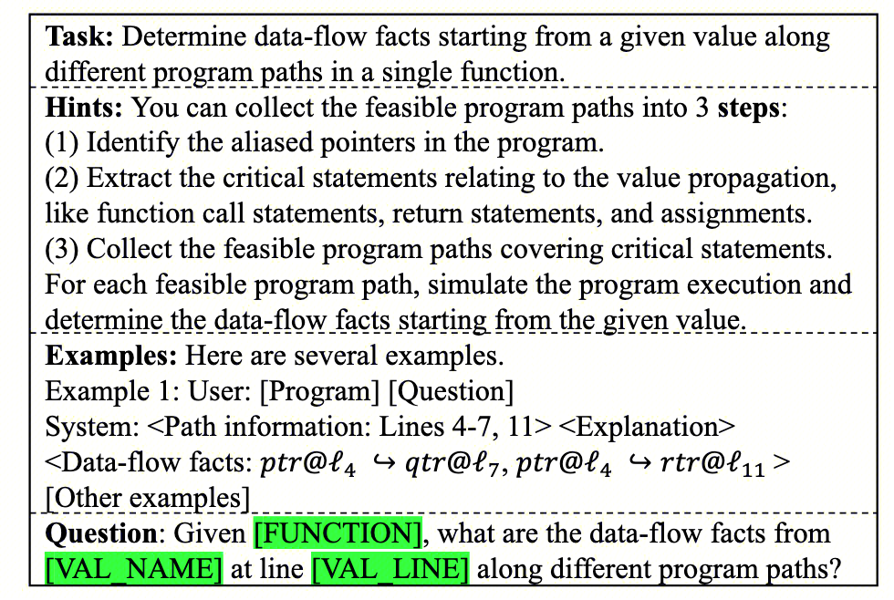
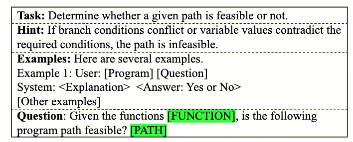

今年，Vibe Coding爆火，文学专精的朋友和我说他也能写App了。

> 那他是不是也能参加找bug行列了。


为此，就有了这篇的解读。RepoAudit([参看原论文和项目指路](https://github.com/PurCL/RepoAudit))

其实思路整体很简单，主要是想分享一下代码设计。
给准备入门手撸SE/Security Agent的大伙，提供一个简单的结构设计。当然，可以去参考SWE-agent之类的。
> 就看你觉得agent到什么程度才算agent吧。

本文主要解决Source-Sink类问题，文中主要是NPD、MLK、UAF。换句话，我觉得这篇的核心是LLM能够抽象方法，并理解数据流。如果能够有一种封装方式，污点分析将真正变成，口述（自然语言）污点源汇，LLM自己找，自己做。人人都会的污点分析的时代即将到来 ^_^(惊？) 

### 基本观察

**直接prompt很难work。**

- 直接切片询问model。这种方法通常无法应对非本地错误，非本地错误可能需要对跨越多个函数、类和文件的大量互连代码片段进行推理。即source-sink reachability.
- 代码库中的控制、数据流等跨依赖关系，很难被精确定义。大量的graph dependencies超过了任何LLM训练前数据样本中存在的隐式图形结构的复杂性。因此prompting会失效。

**人类审计**

- 人类审计员倾向于通过遵循表示执行顺序的路径来探索代码中的复杂图形结构。

**Solution**

- 图遍历：路径敏感和需求驱动，实现对人类审计的模仿
- 通过验证几个形式良好的属性来净化最终输出，最大限度地减少固有的幻觉


### 关于llm

**Intrinsic Strengths of LLMs**

当范围有限时，LLM可以有效地进行基本分析。
- 程序抽象：抽象只关心的statements
- 指针处理：人类审计员根据程序语义，其实可以比较直观和准确地确定一个特定变量的指向关系。
- 可达程序路径探索.

### Workflow

**initiator – explorer – validator**

- initiator – 识别起点。例如null（空指针解引用问题）
- explorer – 检索相关的函数。首先使用包含起点的函数查询LLM（不像传统的基于编译器的自动扫描器显式且以编程方式列举函数内的各个路径，而是利用LLM的固有能力隐式地区分相关路径与不相关路径以及仅与前者相关的原因），如果相关则生成对应的后续prompts 扫描caller / callee。
- validator – 检查结果，并且还通过检查有错误的程序路径的路径条件来检查错误报告候选项。

##### **details**

- 以代理为中心的方法，每个函数是一个单元，对每个单元进行prompt
- 专用代理memory确保跨函数的分析结果无缝共享。

**Initiator**
- 起点，a few lines of code。在常规的污点分析中，其实就是找到source的所在，这里可以比较粗略地去寻找，例如NULL等关键词。

**Explorer**
- 对每一个source value from initiator，采用一轮scan
	- 根据需求 traverse 函数子集，一次通过llm查询一个函数，将结果存储到memory，包含三个操作analyzing individual functions, selecting functions for exploration, and generating bug report candidates.
- analyzing individual functions
	- 实际为执行上述的三个**Intrinsic Strengths of LLMs**
	-    
	- **Agent Memory. **M(f, v@s)
- selecting functions for exploration
	- 根据调用关系找到下一个探索的。NULL情形实际上是去找caller。
- generating bug report candidates
	- 评估新的缺陷候选是否被找到，实际上identifies any new data-flow facts reaching a sink value。

**Validator**
- Alignment Validation of Data-flow Facts and Control Flow.
- 只有当不同函数中的路径条件不矛盾时，错误报告候选才有效。
- Prompt如下
   

## 源码解析

首先简单看看目录，很标准的agent结构。
 ```
RepoAudit/src:
├── ui/
├── repoaudit.py
├── memory/
│   ├── syntactic/
│   │   ├── api.py
│   │   ├── value.py
│   │   ├── function.py
│   ├── semantic/
│   │   ├── dfbscan_state.py
│   │   ├── metascan_state.py
│   │   ├── state.py
│   ├── report/
├── llmtool/
│   ├── LLM_tool.py
│   ├── LLM_utils.py
│   ├── dfbscan/
│   │   ├── intra_dataflow_analyzer.py
│   │   ├── path_validator.py
├── agent/
│   ├── metascan.py
│   ├── agent.py
│   ├── dfbscan.py
├── prompt/
├── tstool/
│   ├── dfbscan_extractor/
│   │   ├── Cpp/
│   │   │   ├── Cpp_MLK_extractor.py
│   │   │   ├── Cpp_NPD_extractor.py
│   │   ├── dfbscan_extractor.py
```
### LLM 相关

#### LLM交互

`LLM_utils.py`：用来和各种LLM进行chat，简单理解为下面这部分代码即可。
``` python
class LLM:
	response = client.chat.completions.create(
                model=self.online_model_name,
                messages=model_input,
                temperature=self.temperature,
                )
```
`LLM_tool.py：`用来定义LLM相关的BaseTool，简单可以理解为：
- LLm tool是调用LLm的工具。它需要以对应的LLMInput输入，在这里处理prompt。然后在此处理response，生成LLMOutput。

```python
class LLMTool(abc):
	self.model = LLM(model_name, self.logger, temperature)
	self.cache: Dict[LLMToolInput, LLMToolOutput] = {}
    
    def _get_prompt(self, input: LLMToolInput) -> str: ...
    def _parse_response(self, response: str, input: Optional[LLMToolInput] = None) -> Optional[LLMToolOutput]: ...
    def invoke(self, input: LLMToolInput, cls: Type[T]) -> Optional[T]:
```
基于上述的tool，显然可以去实现上述所述的两个prompt截图片段，分别位于上述的**Explorer-**Analyzing individual functions 和 **Validator**。
为此，就有了`dfbscan/`：`IntraDataFlowAnalyzer.py 和` `path_validator.py`。
- 基本上就是标准的对prompt中的信息进行替换。
- 然后将输出处理为标准的格式。

所以接下来，我们就紧接着讨论下prompt。
#### Prompt

文中给了四种PL的prompt，但整体思路是类似的，所以只讨论C/C++。
与前文对应，prompt自然也会为了`IntraDataFlowAnalyzer.py 和` `path_validator.py` 进行设计。
`Intra-procedural Data Flow Analyzer``:
Prompt design也是很标准的，不过应该也很考验技术，主要包括以下几部分：
- `system_role ：强调一下专精当前的PL`
- `task：`给定`variable/parameter/expression (denoted as SRC) at a specific line (denoted as L1)；分析执行流，判断可达的位置。`
- `analysis_rules：整体可以看做两部分。`
- `analysis_examples`：标准的few-shot，不过写的非常详细。
- `question_template：`SRC at Lk 可以传播到哪？
- `answer_format_cot：回答的格式，实际上是`
- `meta_prompts：基本问题`的数据，例如具体的SRC、Line和函数体，并将上述QA部分的prompt嵌入到这其中。

核心用来提问的prompt如下：

```py
"meta_prompts": [
  "Now I will give you a target function with the source point `<SRC_NAME>` at line <SRC_LINE>: \n```\n<FUNCTION>\n``` \n\n",
  "You may see the following statements as potential sink points. Identify which of these are related to SRC and its aliases;\n",
  "<SINK_VALUES>\n",
  "Here are the function call sites and return statements within the function, which can be used in Step 1;\n",
  "<CALL_STATEMENTS>\n",
  "<RETURN_VALUES>\n",
  "Now, please answer the following question:\n<QUESTION>\n",
  "Your response should strictly follow the format:\n<ANSWER>\n"
]
```
`path_validator`：
基本和上面类似，就不过多赘述了。可以参看上面那个图，或者源Repo。

### 代码处理相关

尽管本文的实现采用了tree-sitter，但实际上，只要足够财大气粗，这部分未尝不可LLM。例如，1. 理解一下file对应的function，存起来；然后再构建一个新的prompt来找到相关的function。2. 让llm直接大规模根据潜在的关键词，找到源和汇。
总体包括两部分 analyzer 和 extractor。
analyzer: 提取代码信息。
- 代码的基本/元信息：例如函数签名、返回值、if、loop表达式，全局信息例如macro，
- 调用点的信息：调用和被调函数的信息、`调用点callsites`、调用参数argu。

dfbscan_extractor:三类bug的source、sink提取
- 比如`NPD`就是，源就是下面这些，汇就是各种访问：
	```py
	1. ptr = NULL;
    2. return NULL;
    3. (type)* ptr = NULL;
	```

这一部分如果有一些代码分析的基础，其实非常好理解。但是回归到比较传统的AST上的信息提取，因此不过多赘述，你完全可以用别的方案找到潜在的源和汇。当然，有兴趣也可以看看tree-sitter的教程，利用tree-sitter可以很快做AST上的增删改查。
### Memory/State相关

实现上，给了三种Memory，与常规的定义也比较相似。
- `report/` ：漏洞报告。这个应该没什么好讲的，后面略。
- `syntactic/：`一些从前面分析直接能够得到的内容。
- `semantic/：`一些需要LLM理解才能得到的。

`syntactic/：`
- api.py：用来记录library function：name、参数等
- `Function`.py：记录了函数的基本信息，id、code、path、lines、signatures，返回值，可能的call ，条件和循环语句sites，
- `value.py`：直观上来讲，就是记录合法的值要满足的格式，和对应的label（值类型，比如src、sink，para）。比如`"((name, file, line_number, index), label)"`，形如这样。

`semantic/：`记录分析的结果。
- `metascan_state.py : 约等于tstool分析结果的记录。可以理解为 func_id --> metadata.`
- dfbscan_state.py: 这个用来记录数据流分析的结果，包括：
	- 数据流分析记忆：源、汇的值；可达性分析，例如Data-flows，以及过程间分析经常需要考虑的parameter到argument的问题
	- 漏洞分析记忆：潜在的bug路径、bug报告

### Agent相关

实际上看完前面的分析，你大概已经知道整个workflow是怎么设计的了，agent属于是手到擒来。
> 回顾论文内容，自然就是首先找到疑似的source （initiator），然后不断去找sink的点即可（explorer），最后再去validate这条路径的有效。

论文实现上，将agent分为了两个，实际上感觉都行，不过这应该也是和semantic的state进行对应吧。
- `metascan.py`：这个是用来处理基本函数信息的。对应`metascan_state`
- `dfbscan.py` ：这个是用来处理数据流分析的。对应`dfbscan_state`

#### metascan

从start_scan开始，记录一系列的函数信息于一个dict()中，然后更新到state中。包括：
`function_id` `function_name` `function_start_line` `parameters` `retvals` `caller_ids` `loop_statements` 等，上面其实已经有所提及。

#### dfbscan

使用到上述的`IntraDataFlowAnalyzer` 和 `PathValidator` ，相关信息保存到`dfbscan_state。`在初始化的过程中，获取到相关bug的source和sink。
然后从start_scan开始，处理每一个source，就像人做数据流分析一样：
1. 构建初始的分析对象（source，function，context），加到worklist里面。
2. 重复以下步骤，直到worklist为空（无流传播）：
	1. 构造LLM输入，即需要补全前面prompt需要的内容：查询`sink_values, call_statements, ret_values`。
	2. 处理LLM输出：处理`reachable_values`，增加当前path的可达值，更新state中的`reachable_values_per_path`
	3. 更新worklist：根据不同的value类型（para，argument，return），更新worklist。
	4. 其他：为了避免过长调用，可以限制最大调用深度。
3. 处理可能的bug path
	1. `记录potential_buggy_paths`
	2. 然后通过validator证明问题。与上面类似，此处略。
	3. 报告bug。